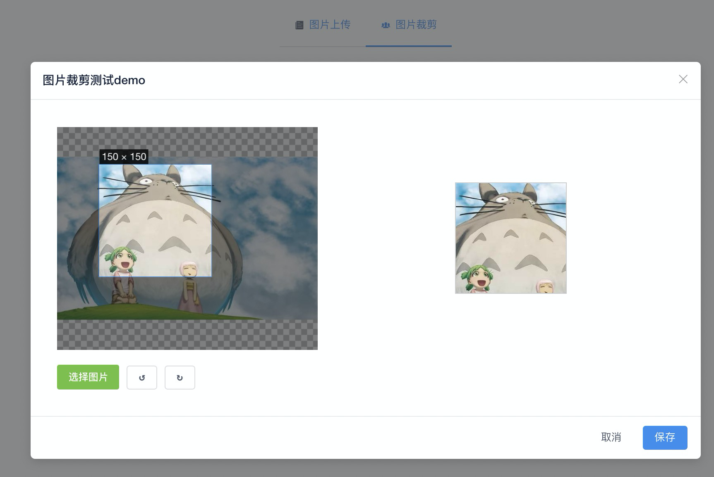
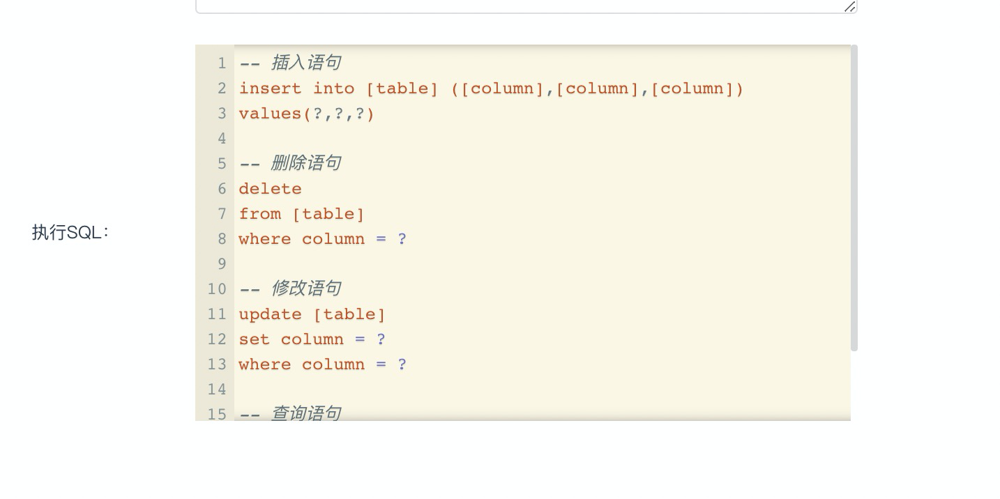

# iview-commonly-used-commponents
基于iview常用组件，如图片裁剪、头像上传、sql编辑等等组件

## 环境安装

前端代码运行本地需安装node.js 以及 vue-cli

### node.js 安装
[node.js 下载地址](https://nodejs.org/zh-cn/").
### vue-cli 安装
```
npm install -g @vue/cli
```

## git基操
```
git checkout develop （切换到开发分支）
npm install  安装第三方包 (第一次创建项目\有更新的话需要执行此命令)
git  init  初始化 (只有第一次创建项目需要执行此命令)
git add . （添加到暂存区域）
git commit -m （'提交文件的描述信息'  添加描述）
git checkout develop  （切换到开发分支）
git pull （拉取最新dev代码）
```


### Compiles and hot-reloads for development（运行）
```
npm run serve
```
### 图片预览




### Customize configuration
See [Configuration Reference](https://cli.vuejs.org/config/).
